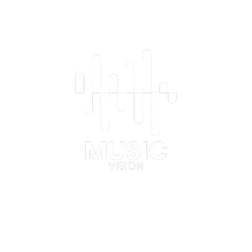

## Music Vision

<p align="center">
  
</p>

<p align="center">
  Dashboard interativo de streaming musical desenvolvido com HTML, CSS e JavaScript.
</p>

---

# ➤ Sobre o Projeto

O Music Vision é um dashboard de streaming musical criado para visualizar e gerenciar informações de músicas.
O sistema permite pesquisar músicas, visualizar estatísticas em tempo real, adicionar novos registros e armazenar os dados utilizando localStorage.

---

# ➤ Funcionalidades

• Dashboard interativo  
• Pesquisa de músicas em tempo real  
• Cadastro de novas músicas  
• Remoção de músicas  
• Persistência com localStorage  
• Interface responsiva  
• Indicadores automáticos  

---

# ➤ Indicadores do Dashboard

• Total de músicas
• Total de plays
• Média de duração
• Música mais tocada

---

# ➤ Tecnologias Utilizadas

• HTML5
• CSS3
• JavaScript
• LocalStorage
• Canva
• Flaticon

---

# ➤ Estrutura do Projeto

```txt
Music-Vision/
│
├── assets/
│   ├── favicon.png
│   ├── logo.png
│   └── lupa.png
│
├── index.html
├── style.css
├── script.js
└── README.md
```

---

# ➤ Visual

| Cor | Hexadecimal |
|---|---|
| Roxo principal | `#a855f7` |
| Roxo hover | `#9333ea` |
| Fundo principal | `#0f0f1a` |
| Cards | `#1b1b2f` |
| Texto | `#ffffff` |

---

# ➤ Responsividade

O projeto foi desenvolvido utilizando:

- Flexbox
- Grid Layout
- Media Queries

Adaptando-se para:
- Desktop
- Tablets
- Smartphones

---

# ➤ Equipe

- Leticia
- Flávia
- Eduardo
